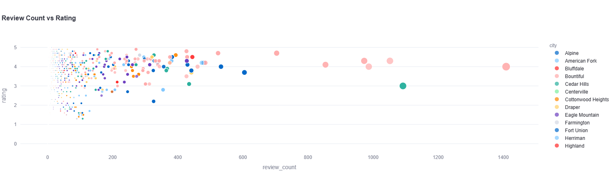
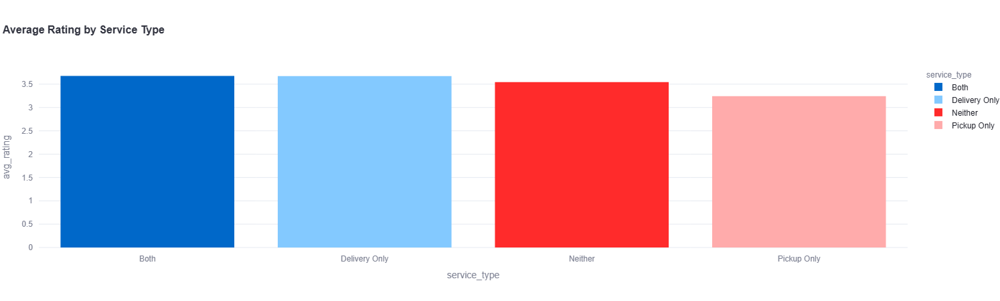
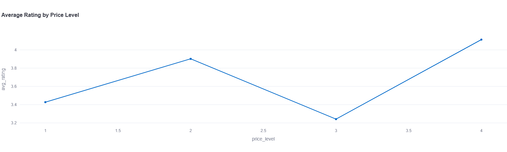
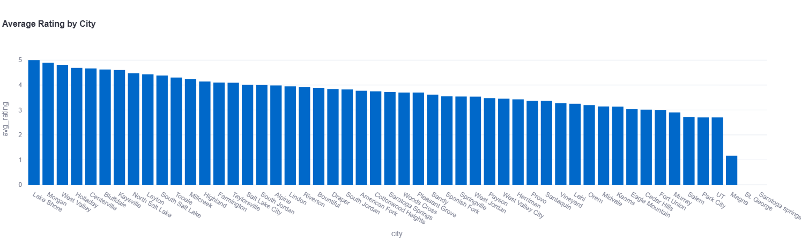

## Introduction and Motivation 

Ice cream is a widely enjoyed dessert across age groups, and consumers often rely on online reviews and ratings when deciding which ice cream shop to visit. Yelp is a popular online platform that allows patrons to leave reviews for local businesses, which are aggregated into an overall rating for each establishment. These ratings play a significant role in shaping consumer perception and decision-making. 

As frequent consumers of ice cream in the Utah County and Salt Lake County areas, this project sought to examine which elements of an ice cream shop’s Yelp profile are associated with higher or lower average ratings. Specifically, this analysis focused on the relationship between average rating and four key business characteristics: review volume, services offered (delivery and pickup), price level, and city location. Understanding these relationships provides insight into consumer behavior and may offer practical implications for local businesses. 

---

## Project Overview and Roadmap 

The development of this project was not linear. The initial project proposal involved the use of a different API and focused on music-related research questions rather than local businesses. However, early in the development process, several obstacles emerged. One of the intended APIs required a subscription fee that exceeded the project’s budget, while another API had discontinued the endpoints necessary to answer the proposed research questions. 

After encountering multiple setbacks, the project scope was reassessed, and a new direction was chosen. The Yelp Fusion API was identified as a viable alternative due to its accessibility and rich business-level data. This shift allowed the project to focus on a more localized and tangible research question centered on ice cream shops. 

The final project workflow consisted of obtaining an API key for the Yelp Fusion API, collecting data on ice cream shops across selected Utah cities, and developing a Python package to clean and analyze the data. Exploratory data analysis was conducted using the same package, and the results were communicated through a deployed Streamlit application. Comprehensive documentation and a user tutorial were created and hosted on GitHub Pages to demonstrate how others could replicate the analysis using the provided tools. 

---

## Data Collection

All data used in this project were obtained from the Yelp Fusion API, which is Yelp’s publicly available API for developers. Data were collected using the /businesses/search endpoint, which allows users to query businesses by keyword, category, location, and price level. For this analysis, the category Ice Cream & Frozen Yogurt was used to restrict the dataset to ice cream-related businesses. 

A Python function was developed to paginate through multiple cities in Utah County and Salt Lake County, ensuring comprehensive data collection within API limitations. The cities included in the data collection process were Provo, Orem, Lehi, American Fork, Pleasant Grove, Spanish Fork, Springville, Lindon, Highland, Salt Lake City, West Valley City, Sandy, Draper, West Jordan, South Jordan, Midvale, and Murray. 

The collected data were saved as a CSV file for further processing. The raw dataset contained 2,729 rows and 30 columns, with each row representing a unique ice cream business. Key variables included business identifiers, review counts, ratings, price level, transaction types, geographic information, and operational attributes.

---

## Data Cleaning and Preparation

A primary objective of the Python package developed for this project, yelp_final_project, was to transform raw Yelp API data into a format suitable for analysis. The first data-cleaning step involved converting the price variable from symbolic dollar signs into a numeric integer by counting the number of dollar symbols associated with each business. 

Next, a service type variable was created to capture whether a business offered delivery, pickup, both, or neither. This classification was derived from the transactions column and allowed for more meaningful comparisons across service offerings. 

Additional cleaning steps included standardizing column names by converting them to lowercase and replacing spaces with underscores, removing columns that were not relevant to the analysis, and sorting the data by city. These steps resulted in a cleaned dataset that was easier to interpret and analyze. A preview of the final cleaned dataset is shown in Table X. 

---

## Exploratory Data Analysis 

The second major function of the Python package was to support exploratory data analysis (EDA). The analysis focused on how average Yelp ratings relate to review volume, service type, price level, and city location. To facilitate comparison, the data were aggregated by each feature of interest, and summary tables were created. 

To examine the relationship between review volume and rating, businesses were grouped by city, and the average rating and average review count were computed. A scatter plot was generated using the Streamlit application to assess potential trends between review count and average rating. 

Service type was analyzed by grouping businesses according to their delivery and pickup options and calculating the average rating for each group. These results were visualized using a bar chart. Similarly, price level was analyzed by computing the average rating for each price category and visualizing the results with a bar chart. 

Finally, city-level analysis was conducted by grouping businesses by city and calculating average ratings. Cities were ranked by rating, and the results were visualized using both bar charts and a geographic heat map that incorporated latitude and longitude data. The heat map displayed business locations, with color indicating rating and bubble size representing review volume. 

---

## Results

This analysis examined the impact of review volume, service type, price level, and city on the average rating of ice cream shops. Among these variables, city location exhibited the strongest association with average rating. 

No clear trend was observed between review volume and rating. As review counts increased, ratings continued to exhibit a wide and consistent spread, indicating that a higher number of reviews does not necessarily correspond to higher or lower ratings on average. 

Regarding service type, businesses offering both delivery and pickup, as well as those offering delivery only, tended to have slightly higher average ratings than businesses offering pickup only. However, the difference in average ratings across service types was less than half a point, suggesting that while delivery may offer a small advantage, it is not a dominant factor.

Price level also showed no clear linear relationship with rating. The lowest average ratings were observed for businesses in the lowest and third price categories, while the highest average ratings were associated with the second and highest price levels. This pattern may reflect consumer expectations regarding quality at higher price points, though the limited number of businesses at the highest price level should be considered when interpreting these results.

City-level analysis revealed substantial variation in average ratings across locations. This finding suggests that geographic factors, local competition, or consumer preferences may play a role in shaping ratings. The highest-rated cities include Lake Shore, Morgan, West Valley City, and Holladay. 

---